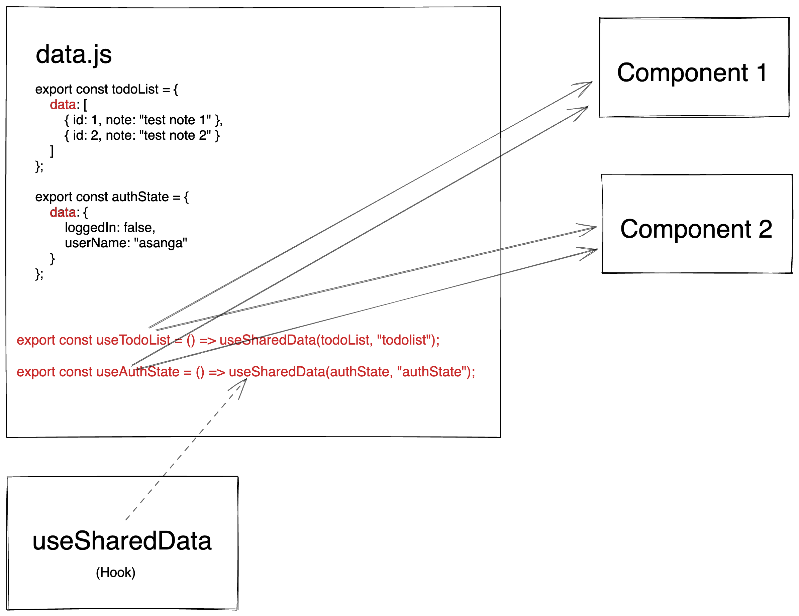

# Hook based simple reactive state

custom hook to share reactive data across components.

`sharedDataHook.js`

# Demo

https://user-images.githubusercontent.com/4988132/189559340-7218a6b1-4157-4980-95cb-2be9fa504ed9.mov

